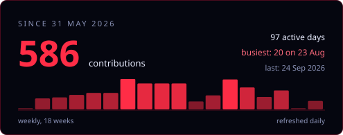

### **`Akshat Dalakoti`**

***“Destiny alone is not enough. Something more is needed.”***

— Geralt of Rivia, *Sword of Destiny*

  the banner is not a video &mdash; it is geometry, and the disc shears 
  because each orbit keeps its own Keplerian period 
  <a href="https://akshatdalakoti-stack.github.io/akshatdalakoti-stack/lab.html#curve">space&#8209;filling curve</a> &middot;
  <a href="https://akshatdalakoti-stack.github.io/akshatdalakoti-stack/lab.html#bolt">lightning</a> &middot;
  <a href="https://akshatdalakoti-stack.github.io/akshatdalakoti-stack/lab.html#slime">slime mold</a> &middot;
  <a href="https://akshatdalakoti-stack.github.io/akshatdalakoti-stack/lab.html#tess">tesseract</a> &middot;
  <a href="https://akshatdalakoti-stack.github.io/akshatdalakoti-stack/lab.html#synth">horizon</a>

---

## About

I build things and take them apart to see why they worked. Most of what I enjoy
sits where clean maths meets something you can actually watch move — simulation,
graphics, embedded control, and the small tools that make the rest less painful.

- 🔭 Currently working on — **[minidb](https://github.com/akshatdalakoti-stack/minidb)**, a
  database storage engine written from scratch in Go on the standard library alone:
  pager, buffer pool, B-tree indexes, a write-ahead log, and crash recovery.
- 💬 Ask me about — storage engines, Redis internals, space-filling curves, or coaxing
  BirdNET onto an ESP32.
- 🧩 Puzzles — [LeetCode: dalakoti_0019_akshat](https://leetcode.com/u/dalakoti_0019_akshat/)
- 📫 Reach me at — **akshatdalakoti@gmail.com** ·
  [LinkedIn](https://www.linkedin.com/in/akshat-dalakoti-82b78137a/)

## Tech

  
  
  
  
  
  
  
  
  

## Stats

## Elsewhere

  
  
  
  

---

Built with an unreasonable amount of care for a README.

